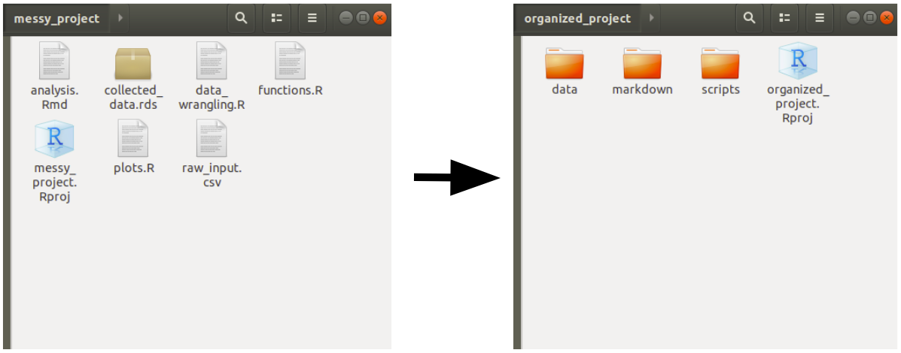
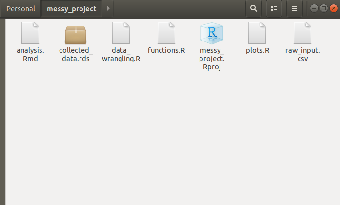

# Using RStudio Project Templates to help the project standardization in data science teams

Many works in the data science realm rely solely upon the data scientist/analyst to guarantee the project standardization and code reproducibility; unfortunately, this becomes a source of confusion/disorganization since everybody (even on the same team) have different work strategies. To help ensure that teams share the same project standards, RStudio offers a sort of cookiecutter, where you can develop (in form of packages) many templates to be shared amongst users on the same team.



---

## The story behind project templates

Recent studies aim to provide the society with methodologies that help users to better understand and organize their projects, data, and insights generated from this data. From [CRISP-DM](https://en.wikipedia.org/wiki/Cross-industry_standard_process_for_data_mining) going all the way to [Team Data Science Process](https://docs.microsoft.com/en-us/azure/machine-learning/team-data-science-process/overview), passing through [KDD](https://en.wikipedia.org/wiki/Data_mining#Process), we have experienced many ways to enhance our ability to work in teams, joining efforts to reach the desired insights faster, and with more reproducibility. 

Nonetheless, this process repeats itself for an infinite number of times, and the process of going back and re-developing an insight, or re-training a model, becomes a challenge because the code that was written long ago, is not easily reachable, and may be hard to understand the whole process that took to develop this project a few weeks/months/years ago.

A few of the projects may look like this:


Even though it may be faster to just open a repository, and just put the scripts, files, functions, .gitignores and any sort of the files needed to deliver a [shiny](https://shiny.rstudio.com/) webpage or a machine learning model, or an analysis of some kind, this process lacks the ability to create code and processes that can be understood by any other person that may be assigned to this project in the future.

So, the aim of this RStudio Project Templates is to help users create some sort of pattern when starting a project, helping the team to standardize the project organization and in a way that everybody can easily be assigned to a project, and understand what is happening there.

And maybe, turn projects into something like this:
```
-- project_directory/
 | -- data/
    | -- raw/
    | -- reference/
    | -- processed/
 | -- scripts/
    | -- modelling/
    | -- analysis/
    | -- production/
 | -- markdown/
 -- .gitignore
 -- project_directory.Rproj
```

---

## Creating a new R Package

The process of R package creation (a fairly simple one) is pretty straightforward. [Hadley's R Package Guide](http://r-pkgs.had.co.nz/) covers many of the caveats involved in the process of creating a package. But since our package will contain only one function, it shouldn't require the complexity involved in the development of a more robust package.

Creating an R package from the project's menu is easy, and should leave the user in front of a sample package, which will contain the R package structure, a `hello.R` function, and a few other files. The first step is to remove the `hello.R` file located at `R/` and the `hello.Rd` file located at `man/`. After that, we start with a clean package, and the first step is to create our function.

## Creating a function that will create a template

To "create the template" we have to instruct how R will deal with it, and how it will behave when we source this function in the New Project menu. So this function takes one mandatory argument, and the other is additional arguments that can help the logic of your Project Creation tool. The first argument will always be the path of this New Project since it'll create a .RProj file as well, it'll be hosted in a new folder. The other arguments of this function are passed as `...` and they can be called within the code with their names, or by assigning them to `dots <- list(...)`.

Our function will do a few tasks, to display a few of the features that can be embedded in the project creation templates. It will:

* Create a README.md file with `writeLines()`;
* If a checkbox is selected, it will create a `.gitignore` file;
* Create a folder with a specific name given a selected input from the user;

To create a function, and ensure that `roxygen2` can interpret it, and export the function that should be exported by the final package, we'll write the function according to the syntax below.

```
#' This package will create a function called create_project()
#'
#' It's callback is at: inst/rstudio/templates/project/create_project.dcf
#'
#' @export

create_project <-
function(path, ...) {

# Create the project path given the name chosen by the user:
dir.create(path, recursive = TRUE, showWarnings = FALSE)

# Change the working directory to the recently created folder:
setwd(file.path(getwd(), path))

# Collect the list of inputs in a list to be called later:
dots <- list(...)

# In the project template we've added 2 choices for the user:
# * One allows them to select if the project will have a .gitignore file
# * The other will create a folder, given a select input from the user

# Check .gitignore argument
if(dots[["createGitignore"]]) {
git_ignores <-
c(
'.Rhistory',
'.Rapp.history',
'.RData',
'.Ruserdata',
'.Rproj.user/',
'.Renviron'
)

writeLines(paste(git_ignores, sep = '\n'), '.gitignore')
}

# Check selected folder
if(dots[["folder"]] == "Production"){
dir.create("production", recursive = TRUE, showWarnings = FALSE)
} else {
dir.create("development", recursive = TRUE, showWarnings = FALSE)
}

}

```

## Creating the `.dcf`file

With the function file created, the next step is to create the `.dcf` file. This file is responsible to create the boxes which the user will interact with. Along with the path that the user will type, you can create as many checkboxes/text inputs/select inputs as you wish to grant customization to the end-user. For our project, we'll create a checkbox, so the user can decide whether to create the `.gitignore` file, and a select input, so the user can define the scope of the project (development or production);

> This solution (development or production) was just created for illustration purposes, it does not reflect any actual state of a project.

The `.dcf` file must be created within the package in the folder `inst/rstudio/templates/project` with the name of your choice, and it should follow the syntax below:

```
Binding: create_project
Title: My First Project Template
OpenFiles: README.md
# In the project you can also add icons (the icon should be a PNG, smaller than 64kb
# and in the inst/rstudio/templates folder
# Icon: name_of_pic.png

Parameter: folder
Widget: SelectInput
Label: Choose the scope of the project
Fields: Production, Development
Default: Production
Position: left

Parameter: createGitignore
Widget: CheckboxInput
Label: Create .gitignore
Default: On
Position: right
```

## `devtools::document() + devtools::install()`

Now that our package structure is created, we can use the `devtools::document()` function to create its documentation pages. Even though this package is mainly developed to be an add-in for RStudio, it's a good practice to document the package, before installing it in R, since it will search for any dependencies and packages that are needed for your project to work.

By running the `devtools::install()` function, within our package, we are going to install it and make it available in any other R Session from now on. This should be enough to make the add-in accessible by RStudio as a New Project Template.

After that, your project template should be available in RStudio's list of projects. If you want to know more about different features to tweak your project template, and add more customizability, please check [RStudio Project Template](https://rstudio.github.io/rstudio-extensions/rstudio_project_templates.html) page.

---

## Conclusion

Given the recent developments in data science and its integration with software engineering techniques, the need to standardize projects within teams comes handy to ensure that everybody can understand, and be understood by their pairs. This allows faster debugging of projects and mitigates the drawbacks of legacy code that is incomprehensible by people in the same teams. Of course, this feature alone will not help to document code, or standardize the way to write R scripts (please refer to [The tidyverse style guide](https://style.tidyverse.org/)), but it is a tool that will help users to create patterns regarding project management.

Check out the [github page](https://github.com/paeselhz/rstudioProjectTemplate) where the code used in this article is hosted, and if you wanna try out this example, clone the repository, or install it in R by running: `devtools::install_github('paeselhz/rstudioProjectTemplate')`.
